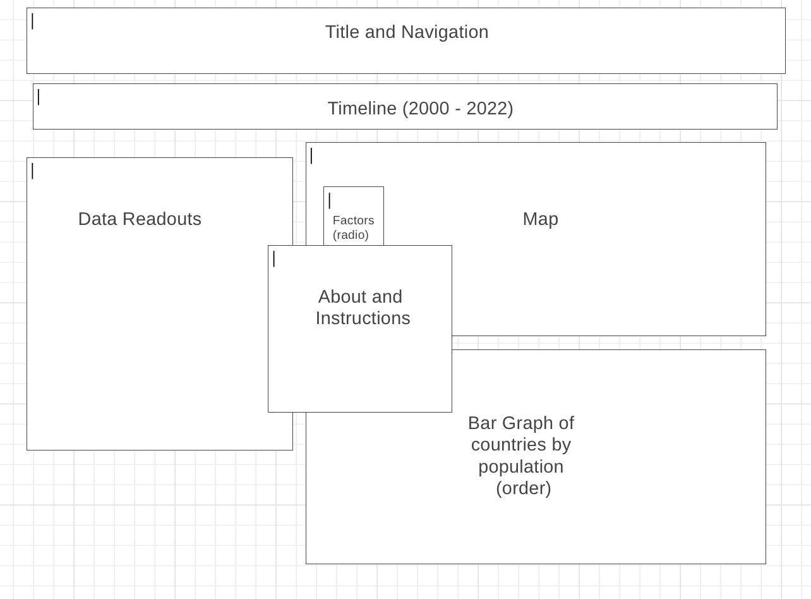
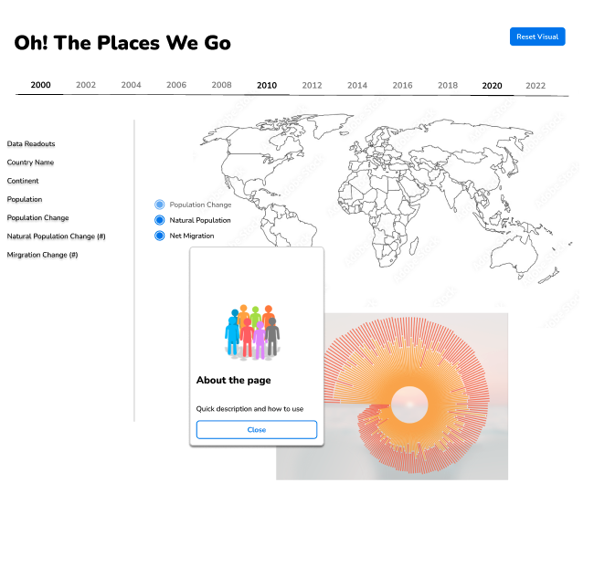
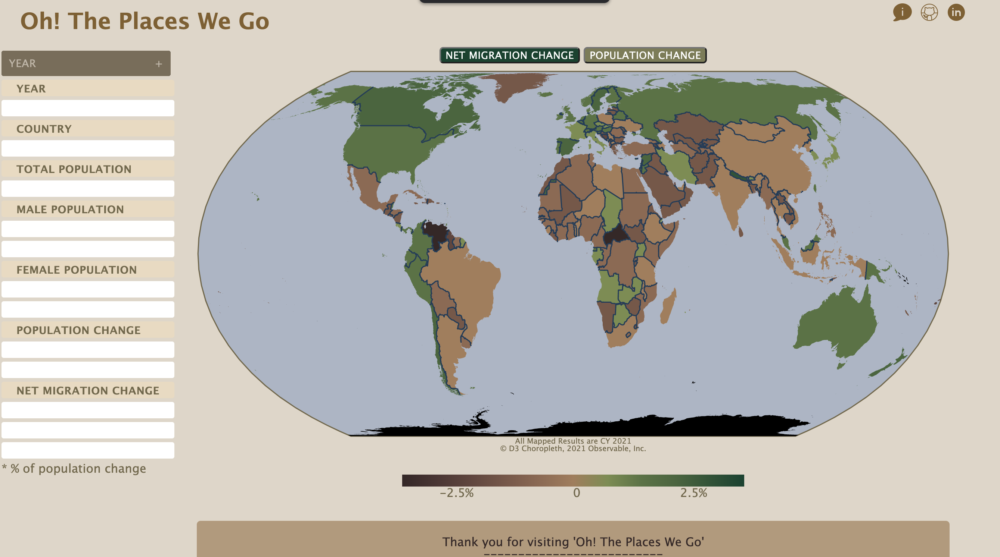
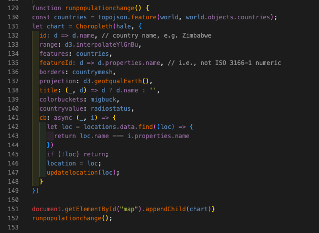
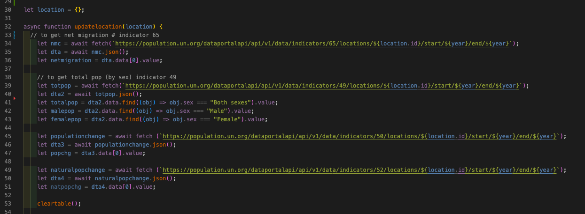
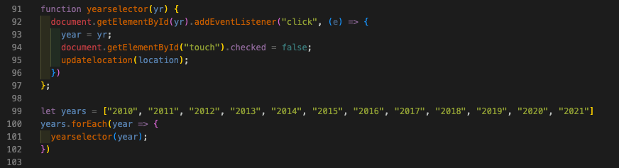
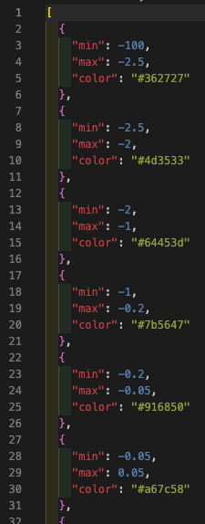
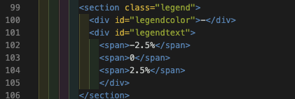
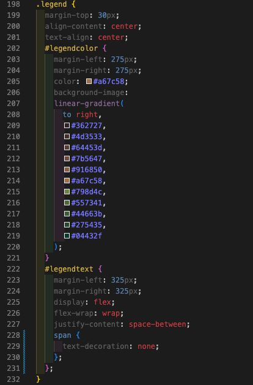

<h1>Oh! The Places We Go</h1>

<section>
<h3>Background:</h3>

Have you ever wondered the impact of net migration on a country’s population? This visual provides a thorough map representation of the % net migration vs total population of each country. There are factor buttons to switch the map graphic to total population change or net migration, all provided by the UN population API. 

This includes a color style graphic per country to indicate growth/decline due to the factor chosen. It pulls the updated data per request for each click the user chooses. 

There is a table readout of key data points that will update with a year selector and for each country selected via the map.

Future possibilities are layering in correlations to migration like GDP, eco-friendly/green score, # hospitals per capita, avg # paid vacation days per year. This would be a great future passion project to continue to build and layer for years to come. 

</section>
 
<section>
<a href="https://shawnaehartley.github.io/Oh-The-Places-We-Go/">Live Link Here</a>
</section>

 

<section>
<h3>Functionality & MVPs:</h3>

In ‘Oh! The Places We Go,’ users will be able to interactive with the below elements:
	<ul>
		<li>Side bar that updates with country selection with total ## data output</li>
		<li>Year selector dropdown for side bar statistics</li>
		<li>Map – Interactive colors (red/brown for decreasing, green for increasing by country shading)</li>
		<li>Map - Factor selectors (radio buttons for the 3 factors in this phase)</li>
		<li>Upon clicking the country on the map all visuals update to select only that country information</li>
	</ul>

</section>

 

<section>
<h3>Wireframe:</h3>
    
</section>

<section>
<h3>Design Plan: </h3>

</section>

<section>
<h3>Fianl Design</h3>

<video width="300" height="300"> 
	<source src="./assets/images/interactivewebpageuse.mov">>
</video> 
</section>

 

<section>
<h3>Technologies, Libraries, APIs:</h3>

This project is implemented with the following technologies:
	<ul>
		<li><a href="https://population.un.org/dataportal/about/dataapi#data-sources">The UN.org population API</a></li>
		<li>Canvas API</li>
		<li>D3 API library</li>
		<li>Webpack</li>
		<li>Npm</li>
		<li><a href="https://app.asana.com/0/1203716781295644/board">Asana Project Manager Suite</a></li>
	</ul>

</section>

 

<section>
<h3>Technical Implementation with Code Snippets:</h3>

<h5>Integrated D3 Choropleth Map Graphic</h5>

<h5>Update Country Selection</h5>

<h5>Update Table Statistics Via Year Click</h5>

<h5>% Change Buckets and Legend</h5>

</section>

 

<section>
<h3>Future Features:</h3>

<ul>
<li>YOY Calculations</li>
<li>3D map graphic</li>
<li>map animation</li>
<li>multi-year selection option for range</li>
<li>user information in modal</li>
<li>additional factors - influences on migration</li>
</ul>

</section>

 

<section>
<h3>Implementation Timeline:</h3>
<ul>
	<h4>Friday:</h4>
		<li>Initial project setup, along with library and technology learning</li>
	<h4>Weekend: </h4>
		<li>API familiarity and project setup</li>
		<li>interactive map on screen via D3 with colors</li>
		<li>Bar graph via D3</li>
	<h4>Monday: </h4>
		<li>Add timeline/year selector and data readouts</li>
		<li>Create Modal</li>
		<li>Setup filter functions</li>
	<h4>Tuesday: </h4>
		<li>Connectivity of filters to the visuals on screen</li>
	<h4>Wednesday: </h4>
		<li>Improve display as needed</li>
		<li>Ensure smooth transitions with factor selectors</li>
		<li>Integration Tests</li>
	<h4>Thursday: </h4>
		<li>Final testing and deploy to GitHub</li>
</ul>
</section>

 

<section>
<h3>Checklists:</h3>
<h4>Live Project</h4>
	<ul>
		<li>Includes links to your portfolio website, GitHub, and LinkedIn</li>
		<li>Landing Page/modal with obvious, clear instructions</li>
		<li>Interactivity of some kind</li>
		<li>Well styled, clean frontend</li>
		<li>If it has music, the option to mute or stop</li>
	</ul>
<h4>Production README</h4>
	<ul>
		<li>Link to live version</li>
		<li>Instructions on how to interact with the project</li>
		<li>List of technologies/APIs/libraries used</li>
		<li>Technical implementation details with (good-looking) code snippets</li>
		<li>To-do’s / future features</li>
		<li>No .DS_Store files / debuggers / console.logs</li>
		<li>Organized file structure, with /src and /dist directories</li>
	</ul>
</section>